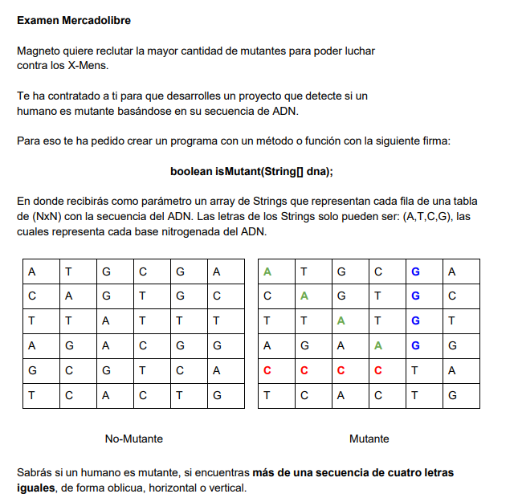
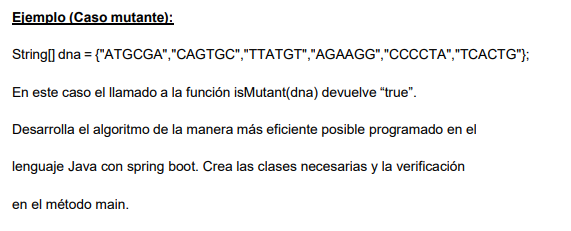
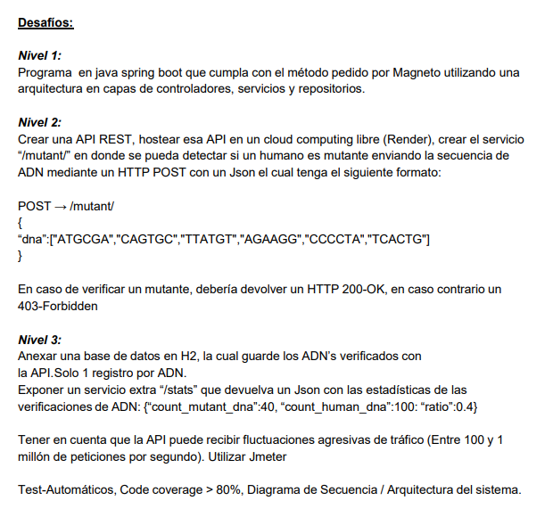
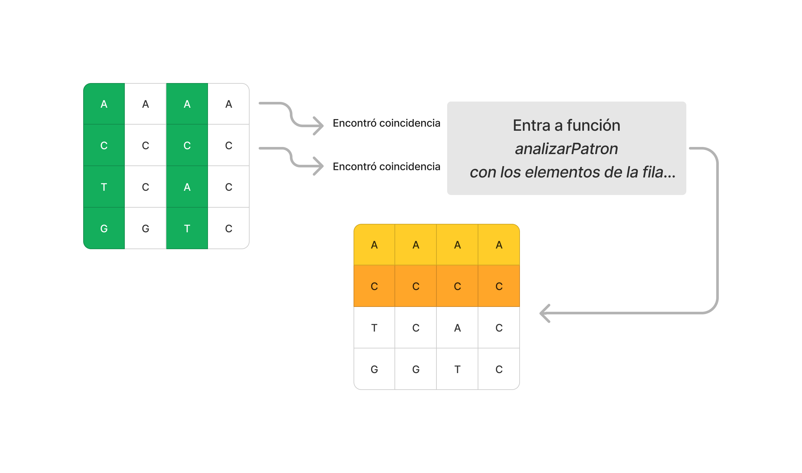
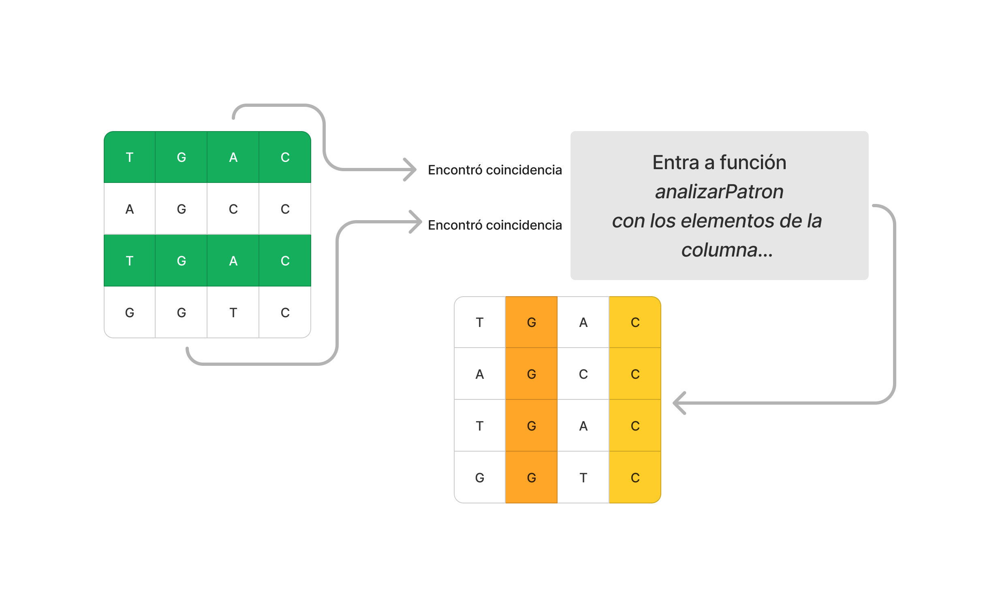

# Code Explanation

## The problem

The trick of this problem is the way in which we coudl search in the matrix. At first one could think that 
there is no other way than going element by element and comparing in every direction until we reach the N,N element, but this is not true.

The problem of going element by element is that the computational complexity of our code is n^2, this meaning that if our input is a list of 
N Strings, our code will be doing N*N iterations, which could be a problem if our input increases.

A way of reducing the complexity of this solution is not going through every element, but giving steps of 2. If you see my code what I try to do 
is iterate every row but iterate the columns in steps of two. Ths decreases our compexity of n^2 to (n^2)/2 which is a huge improvment.

This graphs try to explain this process:

The same when we look for the patter vertically...

And it would be the same when we look for patterns diagonally
